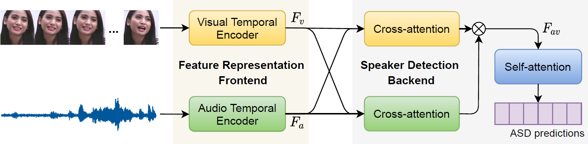

## Is someone talking? TalkNet: Audio-visual active speaker detection Model

This repository contains the code for our ACM MM 2021 paper (oral), TalkNet, an active speaker detection model to detect 'whether the face in the screen is speaking or not?'. [[Paper](https://arxiv.org/pdf/2107.06592.pdf)]    [[Video_English](https://youtu.be/C6bpAgI9zxE)]    [[Video_Chinese](https://www.bilibili.com/video/bv1Yw411d7HG)].

### Updates:

A new [demo page](https://www.sievedata.com/functions/sieve/talknet-asd). Thanks the contribution from [mvoodarla](https://github.com/mvoodarla) !



- [**Awesome ASD**](https://github.com/TaoRuijie/TalkNet_ASD/blob/main/awesomeASD.md): Papers about active speaker detection in last years.

- **TalkNet in AVA-Activespeaker dataset**: The code to preprocess the AVA-ActiveSpeaker dataset, train TalkNet in AVA train set and evaluate it in AVA val/test set. 

- **TalkNet in TalkSet and Columbia ASD dataset**: The code to generate TalkSet, an ASD dataset in the wild, based on VoxCeleb2 and LRS3, train TalkNet in TalkSet and evaluate it in Columnbia ASD dataset.

- **An ASD Demo with pretrained TalkNet model**: An end-to-end script to detect and mark the speaking face by the pretrained TalkNet model. 

***

### Dependencies

Start from building the environment
```
conda create -n TalkNet python=3.7.9 anaconda
conda activate TalkNet
pip install -r requirement.txt
```

Start from the existing environment
```
pip install -r requirement.txt
```

***

## TalkNet in AVA-Activespeaker dataset

#### Data preparation

The following script can be used to download and prepare the AVA dataset for training.

```
python trainTalkNet.py --dataPathAVA AVADataPath --download 
```

`AVADataPath` is the folder you want to save the AVA dataset and its preprocessing outputs, the details can be found in [here](https://github.com/TaoRuijie/TalkNet_ASD/blob/main/utils/tools.py#L34) . Please read them carefully.

#### Training
Then you can train TalkNet in AVA end-to-end by using:
```
python trainTalkNet.py --dataPathAVA AVADataPath
```
`exps/exps1/score.txt`: output score file, `exps/exp1/model/model_00xx.model`: trained model, `exps/exps1/val_res.csv`: prediction for val set.

#### Pretrained model
Our pretrained model performs `mAP: 92.3` in validation set, you can check it by using: 
```
python trainTalkNet.py --dataPathAVA AVADataPath --evaluation
```
The pretrained model will automaticly be downloaded into `TalkNet_ASD/pretrain_AVA.model`. It performs `mAP: 90.8` in the testing set. 

***

## TalkNet in TalkSet and Columbia ASD dataset

#### Data preparation

We find that it is challenge to apply the model we trained in AVA for the videos not in AVA (Reason is [here](https://github.com/TaoRuijie/TalkNet_ASD/blob/main/FAQ.md), Q3.1). So we build TalkSet, an active speaker detection dataset in the wild, based on `VoxCeleb2` and `LRS3`.

We do not plan to upload this dataset since we just modify it, instead of building it. In `TalkSet` folder we provide these `.txt` files to describe which files we used to generate the TalkSet and their ASD labels. You can generate this `TalkSet` if you are interested to train an ASD model in the wild.

Also, we have provided our pretrained TalkNet model in TalkSet. You can evaluate it in Columbia ASD dataset or other raw videos in the wild.

#### Usage

A pretrain model in TalkSet will be download into `TalkNet_ASD/pretrain_TalkSet.model` when using the following script:

```
python demoTalkNet.py --evalCol --colSavePath colDataPath
```

Also, Columnbia ASD dataset and the labels will be downloaded into `colDataPath`. Finally you can get the following F1 result.

| Name |  Bell  |  Boll  |  Lieb  |  Long  |  Sick  |  Avg.  |
|----- | ------ | ------ | ------ | ------ | ------ | ------ |
|  F1  |  98.1  |  88.8  |  98.7  |  98.0  |  97.7  |  96.3  |

(This result is different from that in our paper because we train the model again, while the avg. F1 is very similar)
***

## An ASD Demo with pretrained TalkNet model

#### Data preparation

We build an end-to-end script to detect and extract the active speaker from the raw video by our pretrain model in TalkSet. 

You can put the raw video (`.mp4` and `.avi` are both fine) into the `demo` folder, such as `001.mp4`.

#### Usage

```
python demoTalkNet.py --videoName 001
```

A pretrain model in TalkSet will be downloaded into `TalkNet_ASD/pretrain_TalkSet.model`. The structure of the output reults can be found in [here](https://github.com/TaoRuijie/TalkNet_ASD/blob/main/demoTalkNet.py#L351).

You can get the output video `demo/001/pyavi/video_out.avi`, which has marked the active speaker by green box and non-active speaker by red box.

If you want to evaluate by using cpu only, you can modify `demoTalkNet.py` and `talkNet.py` file: modify all `cuda` into `cpu`. Then replace line 83 in talkNet.py into `loadedState = torch.load(path,map_location=torch.device('cpu'))`

***

### Citation

Please cite the following if our paper or code is helpful to your research.
```
@inproceedings{tao2021someone,
  title={Is Someone Speaking? Exploring Long-term Temporal Features for Audio-visual Active Speaker Detection},
  author={Tao, Ruijie and Pan, Zexu and Das, Rohan Kumar and Qian, Xinyuan and Shou, Mike Zheng and Li, Haizhou},
  booktitle = {Proceedings of the 29th ACM International Conference on Multimedia},
  pages = {3927–3935},
  year={2021}
}
```
I have summaried some potential [FAQs](https://github.com/TaoRuijie/TalkNet_ASD/blob/main/FAQ.md). You can also check the `issues` in Github for other questions that I have answered.

This is my first open-source work, please let me know if I can future improve in this repositories or there is anything wrong in our work. Thanks for your support!

### Acknowledge

We study many useful projects in our codeing process, which includes:

The structure of the project layout and the audio encoder is learnt from this [repository](https://github.com/clovaai/voxceleb_trainer).

Demo for visulization is modified from this [repository](https://github.com/joonson/syncnet_python).

AVA data download code is learnt from this [repository](https://github.com/fuankarion/active-speakers-context).

The model for the visual frontend is learnt from this [repository](https://github.com/lordmartian/deep_avsr).

Thanks for these authors to open source their code!

### Cooperation

If you are interested to work on this topic and have some ideas to implement, I am glad to collaborate and contribute with my experiences & knowlegde in this topic. Please contact me with ruijie.tao@u.nus.edu.

***

## Extra: Verified Environment Setup Commands (2026)

The following commands are validated in this repository on Ubuntu + Python 3.10 + NVIDIA GPU.

### 1) Create and activate a virtual environment

```bash
cd /home/CNF2026900120/Downloads/TalkNet-ASD-main
python3 -m pip install --user virtualenv
python3 -m virtualenv .venv-talknet
source .venv-talknet/bin/activate
```

### 2) (Recommended) Clean pip cache if disk space is low

```bash
rm -rf ~/.cache/pip /tmp/pip-*
mkdir -p ~/.cache/pip
df -h . /tmp
```

### 3) Install PyTorch first (pinned, compatible, and verified)

This avoids very heavy/slow resolver paths (for example, some `torch>=1.6` installs may try `torch 2.11 + CUDA13`).

```bash
source .venv-talknet/bin/activate
pip install --no-cache-dir -i https://pypi.tuna.tsinghua.edu.cn/simple \
  torch==2.3.1 torchvision==0.18.1 torchaudio==2.3.1
```

### 4) Install remaining dependencies

```bash
source .venv-talknet/bin/activate
pip install --no-cache-dir -i https://pypi.tuna.tsinghua.edu.cn/simple \
  scipy pandas scikit-learn scenedetect opencv-python python_speech_features gdown youtube-dl ffmpeg
```

### 5) Quick health check

```bash
source .venv-talknet/bin/activate
python - <<'PY'
import torch, cv2, scenedetect, python_speech_features, gdown
print('torch', torch.__version__)
print('cuda_available', torch.cuda.is_available())
print('cuda_device_count', torch.cuda.device_count())
print('cv2', cv2.__version__)
print('imports_ok')
PY
ffmpeg -version | head -n 1
```

### 6) Run demo inference

Put your input video in `demo/`, for example `demo/001.mp4`:

```bash
cd /home/CNF2026900120/Downloads/TalkNet-ASD-main
source .venv-talknet/bin/activate
python demoTalkNet.py --videoFolder demo --videoName 111


cd /home/CNF2026900120/Downloads/TalkNet-ASD-main
source .venv-talknet/bin/activate
python demoTalkNet.py --videoFolder demo --videoName 111 --chunkDuration 1 --chunkStride 1 --chunkRuns 5


cd /home/CNF2026900120/Downloads/TalkNet-ASD-main
source .venv-talknet/bin/activate
python online_demoTalkNet.py --videoFolder demo --videoName 111 --windowSec 1.0 --inferStrideSec 0.2


#重新运行实时检测

cd /home/CNF2026900120/Downloads/TalkNet-ASD-main
source .venv-talknet/bin/activate
python online_demoTalkNet.py \
  --camera --cameraId 0 --showWindow --flip \
  --windowSec 0.4 --inferStrideSec 0.1 \
  --scoreThres 0.2 --onlyTopSpeaker

python online_demoTalkNet.py \
  --camera --cameraId 0 --showWindow --flip \
  --windowSec 0.6 --inferStrideSec 0.1 \
  --scoreThres -0.2 --onlyTopSpeaker

python online_demoTalkNet.py   --camera --cameraId 0 --showWindow --flip   --windowSec 0.5 --inferStrideSec 0.1   --scoreThres -0.7

python online_demoTalkNet.py   --camera --cameraId 0 --showWindow --flip   --windowSec 0.5 --inferStrideSec 0.1   --scoreThres -0.2


cd /home/CNF2026900120/Downloads/TalkNet-ASD-main
source .venv-talknet/bin/activate
python online_demoTalkNet.py \
  --camera --cameraId 0 --showWindow --flip \
  --windowSec 0.5 --inferStrideSec 0.1 --scoreThres -0.2 \
  --latencyPrintEvery 30 --latencyWarmupFrames 20


cd /home/CNF2026900120/Downloads/TalkNet-ASD-main
source .venv-talknet/bin/activate
python online_demoTalkNet.py \
  --camera --cameraId 0 --showWindow --flip \
  --camWidth 1280 --camHeight 720 \
  --windowSec 0.5 --inferStrideSec 0.1 --scoreThres -0.2 \
  --latencyPrintEvery 30 --latencyWarmupFrames 20


python online_demoTalkNet.py \
  --camera --cameraId 0 --showWindow --flip \
  --camWidth 640 --camHeight 360 --camFps 20 \
  --windowSec 0.5 --inferStrideSec 0.2 --scoreThres -0.2 \
  --latencyPrintEvery 30 --latencyWarmupFrames 20


python online_demoTalkNet.py \
  --camera --cameraId 0 --showWindow --flip \
  --camWidth 960 --camHeight 540 --camFps 20 \
  --windowSec 0.5 --inferStrideSec 0.2 --scoreThres -0.2 \
  --latencyPrintEvery 30 --latencyWarmupFrames 20


python online_demoTalkNet.py   --camera --cameraId 0 --showWindow --flip --windowSec 0.5 --inferStrideSec 0.01 --scoreThres -0.5   --latencyPrintEvery 30 --latencyWarmupFrames 20

cd /home/CNF2026900120/Downloads/TalkNet-ASD-main
source .venv-talknet/bin/activate
python online_demoTalkNet.py \
  --asdBackend talknce \
  --talknceRoot TalkNCE-main \
  --talknceCkpt TalkNCE-main/talknce_ava_pretrained.model \
  --camera --cameraId 0 --showWindow --flip \
  --camWidth 960 --camHeight 540 --camFps 20 \
  --windowSec 1.0 --inferStrideSec 0.1 \
  --scoreThres -0.5 \
  --latencyPrintEvery 30 --latencyWarmupFrames 20

python online_demoTalkNet.py   --asdBackend talknce   --talknceRoot TalkNCE-main   --talknceCkpt TalkNCE-main/talknce_ava_pretrained.model   --camera --cameraId 0 --showWindow --flip   --camWidth 960 --camHeight 540 --windowSec 0.5 --inferStrideSec 0.1   --scoreThres -0.5   --latencyPrintEvery 30 --latencyWarmupFrames 20


python online_demoTalkNet.py \
  --camera --cameraId 0 --showWindow --flip \
  --windowSec 0.5 --inferStrideSec 0.1 --scoreThres -0.5 \
  --enableRobotHeadTrack --robotActiveHoldSec 2.0 \
  --robotCmdTopic /rosci_head_waist_command \
  --robotMsgModule rosci_robot_message.msg \
  --robotCmdMsg HeadWaistCommand


python online_demoTalkNet.py \
  --camera --cameraId 0 --showWindow --flip \
  --faceDetectorBackend mediapipe --mpModelSelection 0 \
  --windowSec 0.5 --inferStrideSec 0.1 --scoreThres -0.2 \
  --enableRobotHeadTrack --robotActiveHoldSec 2.0 \
  --robotCmdTopic /rosci_head_waist_command \
  --robotMsgModule rosci_robot_message.msg \
  --robotCmdMsg HeadWaistCommand

#检测远距离
python online_demoTalkNet.py \
  --camera --cameraId 0 --showWindow --flip \
  --faceDetectorBackend mediapipe --mpModelSelection 1 \
  --detConf 0.5 \
  --windowSec 0.5 --inferStrideSec 0.1 --scoreThres -0.2 \
  --enableRobotHeadTrack --robotActiveHoldSec 2.0 \
  --robotCmdTopic /rosci_head_waist_command \
  --robotMsgModule rosci_robot_message.msg \
  --robotCmdMsg HeadWaistCommand


===========================
迁移部署（还需要读取头部相机和麦克风，注意相机是不是左右反转） 
# 1) 进入项目
cd /your/path/TalkNet-ASD-main

# 2) ROS环境
source /opt/ros/humble/setup.bash

# 3) 初始化Python环境（首次）
python3 -m venv .venv-talknet
source .venv-talknet/bin/activate
pip install -r requirement.txt
pip install sounddevice easydict pyyaml resampy soundfile

# 4) 编译当前目录内的ROS消息工作空间（首次）
deactivate 2>/dev/null || true
source /opt/ros/humble/setup.bash
cd robot_ws
colcon build --packages-select rosci_robot_message --cmake-args -DPython3_EXECUTABLE=/usr/bin/python3
cd ..

# 5) 运行在线检测+头部控制
bash scripts/run_online_with_ros.sh


###
###当前这版 online_demoTalkNet.py 的输入方式是：

###视频：cv2.VideoCapture(--cameraId) 直读设备
###音频：sounddevice 直读麦克风设备
###它不会订阅 ROS 相机/麦克风 topic。

###所以：

###如果机器人上相机和麦克风是本机设备（/dev/video0、默认音频输入）
###不用改架构
###--camera --cameraId 0 可以继续用（cameraId 按实际设备号改）
###如果机器人系统只通过 ROS topic 提供音视频
###需要改代码为 ROS 订阅模式（订阅 Image + 音频 topic）
###这时 --camera --cameraId 0 这套就不适用了
###


=================================

**今日工作日志（TalkNet-ASD，2026-03-25）**

1. 环境与依赖处理  
- 使用 `virtualenv` 建立并使用 `.venv-talknet`。  
- 处理安装中断、缺依赖问题（如 `pandas`）。  
- 清理/说明 pip 缓存与临时文件空间问题。  
- 为摄像头实时模式补充 `sounddevice` 依赖（Python 侧已装），定位系统侧仍缺 `PortAudio`（需你本机 `sudo apt-get install -y libportaudio2 portaudio19-dev`）。

2. 原始离线流程稳定性修复  
- 修复 `numpy` 新版本兼容问题（`np.int` 报错）相关链路。  
- 说明并验证模型下载行为（`sfd_face.pth` 与 `pretrain_TalkSet.model` 的作用与关系）。  
- 确认离线命令可跑通并产出 `video_out.avi`。

3. 功能改进：`demoTalkNet.py` 增强  
- 增加分段连续处理能力（在线仿真式）：`--chunkDuration`、`--chunkStride`、`--chunkRuns`。  
- 改为单次加载模型后多轮处理，避免每轮重复加载。  
- 产出按 chunk 拆分的结果目录，便于延迟拆解与对比。  
- 文件：[demoTalkNet.py](/home/CNF2026900120/Downloads/TalkNet-ASD-main/demoTalkNet.py)

4. 新增性能分析脚本（离线/稳态）  
- 新增整段 warm e2e 分析脚本：阶段延迟 + RSS/GPU 统计。  
  文件：[profile_demoTalkNet_warm_e2e.py](/home/CNF2026900120/Downloads/TalkNet-ASD-main/profile_demoTalkNet_warm_e2e.py)  
- 新增 TalkNet 模型稳态分析脚本：一次加载，多次推理，输出 p50/p95 与内存显存。  
  文件：[profile_talknet_steady_infer.py](/home/CNF2026900120/Downloads/TalkNet-ASD-main/profile_talknet_steady_infer.py)  
- 保留并完善阶段内存统计脚本：  
  文件：[profile_demoTalkNet_memory.py](/home/CNF2026900120/Downloads/TalkNet-ASD-main/profile_demoTalkNet_memory.py)

5. 功能改进：在线推理脚本重构  
- 大幅改造 [online_demoTalkNet.py](/home/CNF2026900120/Downloads/TalkNet-ASD-main/online_demoTalkNet.py)：  
- 修复在线漏检核心问题：  
  - 对齐离线裁剪预处理逻辑（关键修复点）。  
  - 引入离线同款多时长 `durationSet` 融合打分。  
  - 增加轨迹/分数平滑。  
  - 支持 `--onlyTopSpeaker`（每帧只标一个说话人）。  
- 增加终端关键统计：`avg_fps`、score 分布、active ratio。  
- 清理噪声 warning，终端可读性提升。  

6. 新增在线稳态压测脚本  
- 新增 [profile_online_demoTalkNet_steady.py](/home/CNF2026900120/Downloads/TalkNet-ASD-main/profile_online_demoTalkNet_steady.py)：  
- 多轮运行 + warmup 剔除，汇总：  
  - `avg_fps`、`per_frame_latency_ms`、`decision_latency_ms_est`  
  - `rss_peak/rss_avg`、`gpu_peak/gpu_avg`  
  - `active_ratio`  
- 输出 JSON 到 `demo/<video>/pywork/profile_online_demoTalkNet_steady.json`。

7. 摄像头实时能力（新增）  
- 在 `online_demoTalkNet.py` 中增加实时模式开关：  
  - `--camera`、`--cameraId`、`--micDevice`、`--showWindow`、`--flip`、`--saveLiveVideo` 等。  
- 支持“摄像头帧 + 麦克风环形缓冲音频”实时检测，按 `q` 退出。  
- 已通过语法检查；当前阻塞点仅系统缺 `PortAudio` 动态库。

8. 文档更新  
- 将安装与运行命令沉淀到 README 末尾，并持续补充可执行命令。  
- 文件：[README.md](/home/CNF2026900120/Downloads/TalkNet-ASD-main/README.md)

9. 今日关键产物  
- 在线/离线输出视频与 profile JSON 已生成多份，例如：  
- [profile_online_demoTalkNet_steady.json](/home/CNF2026900120/Downloads/TalkNet-ASD-main/demo/111/pywork/profile_online_demoTalkNet_steady.json)  
- [video_out.avi](/home/CNF2026900120/Downloads/TalkNet-ASD-main/demo/111_online/video_out.avi)  
- [profile_demoTalkNet_warm_e2e.json](/home/CNF2026900120/Downloads/TalkNet-ASD-main/demo/111/pywork/profile_demoTalkNet_warm_e2e.json)

如果你要，我下一步可以把这份再整理成“日报模板版”（目标/完成/问题/风险/明日计划）一页格式。

========

## Online 人脸检测后端切换（S3FD / MediaPipe）

`online_demoTalkNet.py` 新增参数：
- `--faceDetectorBackend s3fd|mediapipe`（默认 `s3fd`）
- `--mpModelSelection 0|1`（仅 MediaPipe 生效，`0` 近距离，`1` 远距离）
- `--mpModelPath /abs/path/model.tflite`（可选；不传则自动下载官方 BlazeFace 模型到 `model/faceDetector/mediapipe/`）

先安装 MediaPipe（如果还没装）：
```bash
source .venv-talknet/bin/activate
pip install mediapipe
```

摄像头实时（MediaPipe 替代 S3FD）：
```bash
source .venv-talknet/bin/activate
python online_demoTalkNet.py \
  --camera --cameraId 0 --showWindow --flip \
  --faceDetectorBackend mediapipe --mpModelSelection 0 \
  --windowSec 0.5 --inferStrideSec 0.1 --scoreThres -0.2
```

说明：
- `--detConf` 在两种后端都作为检测阈值使用。
- `--facedetScale` 仅对 S3FD 生效，MediaPipe 会忽略该参数。

## 机器人本地设备与关节控制（xuda 版本）

本项目已支持：
- 本地相机优先：支持 `--cameraPath /dev/video2`，并自动按 `--cameraProbeList` 回退探测。
- 本地麦克风：继续使用 `sounddevice` 从本机采集（`--micDevice` 可指定设备）。
- 头部关节 ROS 控制：新增 `fd_dm_pos` 模式，发布到 `/fd_robot/dm_motor/position_cmd`（`fd_msgs/msg/DmPosControlMsg`）。

启动前（机器人侧）建议：
```bash
source /opt/ros/humble/setup.bash
source /home/user/fd_ws/install/setup.bash
```

示例（本地视频/音频 + fd 关节控制）：
```bash
python online_demoTalkNet.py \
  --camera --cameraPath /dev/video2 --showWindow --flip \
  --faceDetectorBackend mediapipe --mpModelSelection 1 --detConf 0.5 \
  --windowSec 0.5 --inferStrideSec 0.1 --scoreThres -0.2 \
  --enableRobotHeadTrack --robotControlMode fd_dm_pos --robotActiveHoldSec 2.0 \
  --fdPosTopic /fd_robot/dm_motor/position_cmd --fdMsgModule fd_msgs.msg --fdPosMsg DmPosControlMsg \
  --fdYawServoId -1 --fdPitchServoId -1
```

说明：
- `--fdYawServoId/--fdPitchServoId` 需要按机器人实际关节 ID 设置；未设置（-1）时不会向该轴发布关节位姿。
- 若仅设置了 `--fdPitchServoId=-1` 且配置了 `--fdHeadUpTopic/--fdHeadDownTopic`，会使用上下话题做 pitch 的降级控制。
- 默认 `--robotControlMode fd_dm_pos`；如需回退旧接口可用 `--robotControlMode rosci`。

### 机器人侧 xuda 新终端一键步骤（先不发关节）

在机器人上新开终端，直接执行：
```bash
cd ~/Downloads/xuda/TalkNet-ASD-main
source /opt/ros/humble/setup.bash
source /home/user/fd_ws/install/setup.bash

# 仅首次需要（若已安装可跳过）
python3 -m pip install --user python_speech_features mediapipe

python3 online_demoTalkNet.py \
  --camera --cameraPath /dev/video2 \
  --cameraProbeList /dev/video2,/dev/video4,0,1,2,3,4,5 \
  --faceDetectorBackend mediapipe --mpModelSelection 1 --detConf 0.5 \
  --windowSec 0.5 --inferStrideSec 0.1 --scoreThres -0.2 \
  --maxSeconds 0 --latencyPrintEvery 30 --latencyWarmupFrames 20
```

说明：
- 若 `/dev/video2` 不可用，会自动回退到 `/dev/video4`（或 probe 列表中的其他设备）。
- 这条命令不加 `--enableRobotHeadTrack`，所以不会发关节控制。

### 机器人侧 xuda 新终端步骤（启用关节控制）

```bash
cd ~/Downloads/xuda/TalkNet-ASD-main
source /opt/ros/humble/setup.bash
source /home/user/fd_ws/install/setup.bash

python3 online_demoTalkNet.py \
  --camera --cameraPath /dev/video2 \
  --cameraProbeList /dev/video4,/dev/video4,0,1,2,3,4,5 \
  --faceDetectorBackend mediapipe --mpModelSelection 1 --detConf 0.5 \
  --windowSec 0.5 --inferStrideSec 0.1 --scoreThres -0.2 \
  --enableRobotHeadTrack --robotControlMode fd_dm_pos --robotActiveHoldSec 2.0 \
  --fdPosTopic /fd_robot/dm_motor/position_cmd --fdMsgModule fd_msgs.msg --fdPosMsg DmPosControlMsg \
  --fdYawServoId -1 --fdPitchServoId -1 \
  --showWindow
```

说明：
- `--fdYawServoId/--fdPitchServoId` 先按 `-1` 跑通链路；拿到真实关节 ID 后再填入。

python3 online_demoTalkNet.py \
  --camera --cameraPath /dev/video2 \
  --cameraProbeList /dev/video4,/dev/video4,0,1,2,3,4,5 \
  --faceDetectorBackend mediapipe --mpModelSelection 1 --detConf 0.5 \
  --windowSec 0.5 --inferStrideSec 0.1 --scoreThres -0.2 \
  --enableRobotHeadTrack --robotControlMode fd_dm_pos --robotActiveHoldSec 2.0 \
  --fdPosTopic /fd_robot/dm_motor/position_cmd --fdMsgModule fd_msgs.msg --fdPosMsg DmPosControlMsg \
  --fdYawServoId 1 --fdPitchServoId 2 \
  --showWindow


  python3 online_demoTalkNet.py \
  --camera --cameraPath /dev/video4 \
  --cameraProbeList /dev/video4,/dev/video4,0,1,2,3,4,5 \
  --faceDetectorBackend mediapipe --mpModelSelection 1 --detConf 0.5 \
  --windowSec 0.5 --inferStrideSec 0.1 --scoreThres -0.2 \
  --enableRobotHeadTrack --robotControlMode fd_dm_pos --robotActiveHoldSec 2.0 \
  --fdPosTopic /fd_robot/dm_motor/position_cmd --fdMsgModule fd_msgs.msg --fdPosMsg DmPosControlMsg \
  --fdYawServoId 1 --fdPitchServoId 2 \


cd ~/yx
source placo_env/bin/activate
cd ~/Downloads/xuda/TalkNet-ASD-main
source /opt/ros/humble/setup.bash
source /home/user/fd_ws/install/setup.bash

python3 online_demoTalkNet.py \
  --camera --cameraPath /dev/video4 \
  --cameraProbeList /dev/video4,/dev/video4,0,1,2,3,4,5 \
  --faceDetectorBackend s3fd --detConf 0.5 \
  --windowSec 0.5 --inferStrideSec 0.1 --scoreThres -0.2 \
  --enableRobotHeadTrack --robotControlMode fd_dm_pos --robotActiveHoldSec 2.0 \
  --fdPosTopic /fd_robot/dm_motor/position_cmd --fdMsgModule fd_msgs.msg --fdPosMsg DmPosControlMsg \
  --fdYawServoId 1 --fdPitchServoId 2 \
  <!-- --audioDebug --audioDebugEverySec 1.0 --audioDebugWindowSec 1.0 \
  --audioDebugCueAtSec 3 --audioDebugCueIntervalSec 6 --audioDebugCueSpeakSec 3 --audioDebugCueCount 3 \
  --maxSeconds 18 -->


cd ~/yx
source placo_env/bin/activate
cd ~/Downloads/xuda/TalkNet-ASD-main

source /opt/ros/humble/setup.bash
source /home/user/fd_ws/install/setup.bash
export ROS_DOMAIN_ID=0
export RMW_IMPLEMENTATION=rmw_fastrtps_cpp
export ROS_LOCALHOST_ONLY=0

python3 online_demoTalkNet.py \
  --camera --cameraPath /dev/video4 \
  --cameraProbeList /dev/video4,/dev/video4,0,1,2,3,4,5 \
  --faceDetectorBackend s3fd --detConf 0.5 \
  --windowSec 0.5 --inferStrideSec 0.1 --scoreThres -5 \
  --enableRobotHeadTrack --robotControlMode fd_head_topic --robotActiveHoldSec 2.0 \
  --fdHeadTopicCmd /fd_robot/head_control/cmd_angles


python3 online_demoTalkNet.py \
  --camera --cameraPath /dev/video4 \
  --cameraProbeList /dev/video4,/dev/video4,0,1,2,3,4,5 \
  --faceDetectorBackend s3fd --detConf 0.5 \
  --windowSec 0.5 --inferStrideSec 0.1 --scoreThres -5 \
  --enableRobotHeadTrack --robotControlMode fd_head_topic --robotActiveHoldSec 2.0 \
  --fdHeadTopicCmd /fd_robot/head_control/cmd_angles \
  --robotYawGain 0.45 \
  --robotPitchGain 0.25 \
  --robotMaxYawRad 0.35 \
  --robotMaxPitchRad 0.20 \
  --showWindow


### TalkNet 当前可继续使用的命令

本次没有修改 `online_demoTalkNet.py`，下面这条命令仍可继续使用：

```bash
cd ~/yx
source placo_env/bin/activate
cd ~/Downloads/xuda/TalkNet-ASD-main
source /opt/ros/humble/setup.bash
source /home/user/fd_ws/install/setup.bash
export ROS_DOMAIN_ID=0
export RMW_IMPLEMENTATION=rmw_fastrtps_cpp
export ROS_LOCALHOST_ONLY=0

python3 online_demoTalkNet.py \
  --camera --cameraPath /dev/video4 \
  --cameraProbeList /dev/video4,/dev/video4,0,1,2,3,4,5 \
  --faceDetectorBackend s3fd --detConf 0.5 \
  --windowSec 0.5 --inferStrideSec 0.1 --scoreThres -5 \
  --enableRobotHeadTrack --robotControlMode fd_head_topic --robotActiveHoldSec 2.0 \
  --fdHeadTopicCmd /fd_robot/head_control/cmd_angles \
  --robotYawGain 0.45 \
  --robotPitchGain 0.25 \
  --robotMaxYawRad 0.35 \
  --robotMaxPitchRad 0.20 \
  --showWindow
```

cd /home/user/Downloads/xuda/TalkNet-ASD-main
source /home/user/yx/placo_env/bin/activate

python3 online_demoTalkNet.py \
  --camera --cameraPath /dev/video4 \
  --cameraProbeList /dev/video4,/dev/video4,0,1,2,3,4,5 \
  --faceDetectorBackend mediapipe \
  --mpRuntime tasks \
  --mpDelegate gpu \
  --mpModelSelection 0 \
  --detConf 0.5 \
  --windowSec 0.5 --inferStrideSec 0.1 --scoreThres -0.2 \
  --enableRobotHeadTrack --robotControlMode fd_head_topic --robotActiveHoldSec 1.5 \
  --fdHeadTopicCmd /fd_robot/head_control/cmd_angles \
  --robotYawGain 0.25 \
  --robotPitchGain 0.25 \
  --robotMaxYawRad 0.35 \
  --robotMaxPitchRad 0.20 \
  --showWindow


jtop查看gpu占用


cd /home/user/Downloads/xuda/TalkNet-ASD-main
source /home/user/yx/placo_env/bin/activate

python3 online_demoTalkNet.py \
  --camera --cameraPath /dev/video4 \
  --cameraProbeList /dev/video4,/dev/video4,0,1,2,3,4,5 \
  --micDevice 0 \
  --faceDetectorBackend s3fd \
  --detConf 0.5 \
  --windowSec 0.5 --inferStrideSec 0.1 --scoreThres -0.2 \
  --enableRobotHeadTrack --robotControlMode fd_head_topic --robotActiveHoldSec 1.5 \
  --fdHeadTopicCmd /fd_robot/head_control/cmd_angles \
  --robotYawGain 0.25 \
  --robotPitchGain 0.25 \
  --robotMaxYawRad 0.35 \
  --robotMaxPitchRad 0.20 \
  --showWindow

python3 online_demoTalkNet.py \
  --camera --cameraPath /dev/video4 \
  --cameraProbeList /dev/video4,/dev/video4,0,1,2,3,4,5 \
  --micDevice 25 \
  --faceDetectorBackend s3fd \
  --detConf 0.5 \
  --windowSec 0.5 --inferStrideSec 0.1 --scoreThres -0.5 \
  --enableRobotHeadTrack --robotControlMode fd_head_topic --robotActiveHoldSec 1.5 \
  --fdHeadTopicCmd /fd_robot/head_control/cmd_angles \
  --robotYawGain 0.25 \
  --robotPitchGain 0.25 \
  --robotMaxYawRad 0.35 \
  --robotMaxPitchRad 0.20 \
  --showWindow

cd /home/user/Downloads/xuda/TalkNet-ASD-main
source /home/user/yx/placo_env/bin/activate

python3 online_demoTalkNet.py \
  --camera --cameraPath /dev/video4 \
  --cameraProbeList /dev/video4,/dev/video4,0,1,2,3,4,5 \
  --micDevice 25 \
  --faceDetectorBackend s3fd \
  --detConf 0.5 \
  --windowSec 0.5 --inferStrideSec 0.1 --scoreThres -0.5 \
  --enableRobotHeadTrack --robotControlMode fd_head_topic --robotActiveHoldSec 1.5 \
  --fdHeadTopicCmd /fd_robot/head_control/cmd_angles \
  --robotYawGain 0.25 \
  --robotPitchGain 0.25 \
  --robotMaxYawRad 0.35 \
  --robotMaxPitchRad 0.20 \
  --httpStream \
  --httpHost 0.0.0.0 \
  --httpPort 8082


python3 online_demoTalkNet.py   --camera --cameraPath /dev/video4   --cameraProbeList /dev/video4,/dev/video4,0,1,2,3,4,5   --micDevice 25   --faceDetectorBackend s3fd   --detConf 0.5   --windowSec 0.5 --inferStrideSec 0.1 --scoreThres -0.7   --enableRobotHeadTrack --robotControlMode fd_head_topic --robotActiveHoldSec 1   --fdHeadTopicCmd /fd_robot/head_control/cmd_angles   --robotYawGain 0.25   --robotPitchGain 0.25   --robotMaxYawRad 0.35   --robotMaxPitchRad 0.20   --httpStream   --httpHost 0.0.0.0   --httpPort 8082 --flip

python3 online_demoTalkNet.py   --camera --cameraPath /dev/video4   --cameraProbeList /dev/video4,/dev/video4,0,1,2,3,4,5   --micDevice 0   --faceDetectorBackend s3fd   --detConf 0.5   --windowSec 0.5 --inferStrideSec 0.1 --scoreThres -0.7   --enableRobotHeadTrack --robotControlMode fd_head_topic --robotActiveHoldSec 1   --fdHeadTopicCmd /fd_robot/head_control/cmd_angles   --robotYawGain 0.25   --robotPitchGain 0.25   --robotMaxYawRad 0.35   --robotMaxPitchRad 0.20   --httpStream   --httpHost 0.0.0.0   --httpPort 8082 --flip

cd /home/user/Downloads/xuda/TalkNet-ASD-main
source /home/user/yx/placo_env/bin/activate

python3 build_trt_engines.py \
  --mode both \
  --pretrainModel pretrain_TalkSet.model \
  --outDir trt_engines \
  --fp16 \
  --s3fdBaseWidth 1920 \
  --s3fdBaseHeight 1080 \
  --s3fdScales 0.5,1.0,1.5 \
  --talknetAudioFrames 50 \
  --talknetVideoFrames 13


cd /home/user/Downloads/xuda/TalkNet-ASD-main
source /home/user/yx/placo_env/bin/activate
export PYTHONPATH=/usr/lib/python3.10/dist-packages:$PYTHONPATH

python3 online_demoTalkNet.py \
  --camera --cameraPath /dev/video4 \
  --cameraProbeList /dev/video4,/dev/video4,0,1,2,3,4,5 \
  --camWidth 1920 --camHeight 1080 \
  --micDevice 0 \
  --faceDetectorBackend s3fd_trt \
  --facedetScale 0.25 \
  --s3fdTrtEngineSpecs 0.25=trt_engines/s3fd_270x480_s0p25.engine \
  --asdBackend talknet_trt \
  --talknetTrtEngine trt_engines/talknet_a50_v13.engine \
  --detConf 0.5 \
  --windowSec 0.5 --inferStrideSec 0.1 --scoreThres -0.7 \
  --enableRobotHeadTrack --robotControlMode fd_head_topic --robotActiveHoldSec 1 \
  --fdHeadTopicCmd /fd_robot/head_control/cmd_angles \
  --robotYawGain 0.25 \
  --robotPitchGain 0.25 \
  --robotMaxYawRad 0.35 \
  --robotMaxPitchRad 0.20 \
  --httpStream --httpHost 0.0.0.0 --httpPort 8082 \
  --flip


python3 online_demoTalkNet.py   --camera --cameraPath /dev/video4   --cameraProbeList /dev/video4,/dev/video4,0,1,2,3,4,5   --camWidth 1920 --camHeight 1080   --micDevice 0   --faceDetectorBackend s3fd_trt   --facedetScale 0.25   --s3fdTrtEngineSpecs 0.25=trt_engines/s3fd_270x480_s0p25.engine   --asdBackend talknet_trt   --talknetTrtEngine trt_engines/talknet_a50_v13.engine   --detConf 0.5   --windowSec 0.5 --inferStrideSec 0.1 --scoreThres -0.7   --enableRobotHeadTrack --robotControlMode fd_head_topic --robotActiveHoldSec 1   --fdHeadTopicCmd /fd_robot/head_control/cmd_angles   --robotYawGain 0.5   --robotPitchGain 0.5   --robotMaxYawRad 0.35   --robotMaxPitchRad 0.20   --httpStream --httpHost 0.0.0.0 --httpPort 8082   --flip

pkill -f fd_iflytek_module_node
fuser -k /dev/video4
cd /home/user/Downloads/xuda/TalkNet-ASD-main
source /home/user/yx/placo_env/bin/activate
export PYTHONPATH=/usr/lib/python3.10/dist-packages:$PYTHONPATH

python3 online_demoTalkNet.py \
  --camera \
  --cameraPath /dev/video4 \
  --cameraProbeList /dev/video4 \
  --camWidth 1920 --camHeight 1080 \
  --micDevice -1 \
  --micAlsaCard AIUIUSBMC \
  --micAlsaChannels 4 \
  --micAlsaChannelMode max_energy \
  --faceDetectorBackend s3fd_trt \
  --facedetScale 0.25 \
  --s3fdTrtEngineSpecs 0.25=trt_engines/s3fd_270x480_s0p25.engine \
  --asdBackend talknet_trt \
  --talknetTrtEngine trt_engines/talknet_a50_v13.engine \
  --detConf 0.5 \
  --windowSec 0.5 \
  --inferStrideSec 0.1 \
  --scoreThres -0.7 \
  --enableRobotHeadTrack \
  --robotControlMode fd_head_topic \
  --robotActiveHoldSec 1 \
  --fdHeadTopicCmd /fd_robot/head_control/cmd_angles \
  --robotYawGain 0.5 \
  --robotPitchGain 0.5 \
  --robotMaxYawRad 0.35 \
  --robotMaxPitchRad 0.20 \
  --httpStream \
  --httpHost 0.0.0.0 \
  --httpPort 8082 \
  --flip


cd /home/user/Downloads/xuda/TalkNet-ASD-main
source /home/user/yx/placo_env/bin/activate
export PYTHONPATH=/usr/lib/python3.10/dist-packages:$PYTHONPATH

python3 online_demoTalkNet.py \
  --camera --cameraPath /dev/video4 \
  --cameraProbeList /dev/video4,/dev/video4,0,1,2,3,4,5 \
  --camWidth 1920 --camHeight 1080 \
  --micDevice -1 \
  --micAlsaCard AIUIUSBMC \
  --micAlsaChannels 4 \
  --faceDetectorBackend s3fd_trt \
  --facedetScale 0.25 \
  --s3fdTrtEngineSpecs 0.25=trt_engines/s3fd_270x480_s0p25.engine \
  --asdBackend talknet_trt \
  --talknetTrtEngine trt_engines/talknet_a50_v13.engine \
  --detConf 0.5 \
  --windowSec 0.5 --inferStrideSec 0.1 --scoreThres -0.7 \
  --enableRobotHeadTrack --robotControlMode fd_head_topic --robotActiveHoldSec 1 \
  --fdHeadTopicCmd /fd_robot/head_control/cmd_angles \
  --robotYawGain 0.5 \
  --robotPitchGain 0.5 \
  --robotMaxYawRad 0.35 \
  --robotMaxPitchRad 0.20 \
  --httpStream --httpHost 0.0.0.0 --httpPort 8082 \
  --flip

cd /home/user/Downloads/xuda/TalkNet-ASD-main
source /home/user/yx/placo_env/bin/activate
export PYTHONPATH=/usr/lib/python3.10/dist-packages:$PYTHONPATH

python3 online_demoTalkNet.py \
  --camera --cameraPath /dev/video4 \
  --cameraProbeList /dev/video4,/dev/video4,0,1,2,3,4,5 \
  --camWidth 1920 --camHeight 1080 \
  --micDevice -1 \
  --micAlsaCard AIUIUSBMC \
  --micAlsaChannels 4 \
  --faceDetectorBackend s3fd_trt \
  --facedetScale 0.25 \
  --s3fdTrtEngineSpecs 0.25=trt_engines/s3fd_270x480_s0p25.engine \
  --asdBackend talknet_trt \
  --talknetTrtEngine trt_engines/talknet_a50_v13.engine \
  --detConf 0.5 \
  --windowSec 0.5 --inferStrideSec 0.1 --scoreThres -0.7 \
  --enableRobotHeadTrack --robotControlMode fd_head_topic --robotActiveHoldSec 1 \
  --fdHeadTopicCmd /fd_robot/head_control/cmd_angles \
  --robotYawGain 0.5 \
  --robotPitchGain 0.5 \
  --robotMaxYawRad 0.35 \
  --robotMaxPitchRad 0.20 \
  --httpStream --httpHost 0.0.0.0 --httpPort 8082 \
  --flip

## 2026-03-31 更新总结

### 今天对 `online_demoTalkNet.py` 做的修改

- 新增 `--httpStream --httpHost --httpPort --httpJpegQuality`
  - 可以把带检测框和说话状态的处理后画面，直接通过 HTTP/MJPEG 网页推流。
  - 适合机器人侧无桌面环境运行，不依赖 `--showWindow`。
- 新增 MediaPipe 后端参数
  - `--faceDetectorBackend mediapipe`
  - `--mpRuntime`
  - `--mpDelegate`
  - 结论：当前这台 AGX Orin 上，现成 `mediapipe` wheel 不能真正走 GPU，报错会提示 `GPU processing is disabled in build flags`。
- 新增 S3FD 多尺度参数
  - `--facedetScales 0.5,1.0,1.5`
  - 用于改善远距离小脸检测。
- 修复在线模式音频/视频长期漂移问题
  - 现在 `RealtimeAudioBuffer` 按真实音频时间戳对齐，而不是按假定样本时钟硬切。
  - 解决了“开始能检测说话，几十秒后 score 长时间掉到负值且不恢复”的问题。
- 修复 `--flip` 后机器人转头左右反向
  - 现在镜像画面和真实转头方向可以同时正确。
- 新增 TRT 后端接入
  - `--faceDetectorBackend s3fd_trt`
  - `--s3fdTrtEngineSpecs`
  - `--asdBackend talknet_trt`
  - `--talknetTrtEngine`
- 新增 TensorRT 构建脚本
  - `build_trt_engines.py`
  - 用于导出 ONNX 并构建 `TalkNet` 和 `S3FD` 的 `.engine`


### HTTP 推流版在线命令

阵列麦 + 普通 S3FD/TalkNet 路径：

```bash
cd /home/user/Downloads/xuda/TalkNet-ASD-main
source /home/user/yx/placo_env/bin/activate

python3 online_demoTalkNet.py \
  --camera --cameraPath /dev/video4 \
  --cameraProbeList /dev/video4,/dev/video4,0,1,2,3,4,5 \
  --micDevice 0 \
  --faceDetectorBackend s3fd \
  --detConf 0.5 \
  --windowSec 0.5 --inferStrideSec 0.1 --scoreThres -0.7 \
  --enableRobotHeadTrack --robotControlMode fd_head_topic --robotActiveHoldSec 1 \
  --fdHeadTopicCmd /fd_robot/head_control/cmd_angles \
  --robotYawGain 0.25 \
  --robotPitchGain 0.25 \
  --robotMaxYawRad 0.35 \
  --robotMaxPitchRad 0.20 \
  --httpStream --httpHost 0.0.0.0 --httpPort 8082 \
  --flip
```

浏览器访问：

```text
http://机器人IP:8082/
```

### TensorRT 构建说明

这里做的不是“整条在线脚本全部变成 TRT”，而是把最吃算力的两个模型推理部分切成 TRT 后端：

- `S3FD`
  - 人脸检测网络主干改成 TensorRT engine。
- `TalkNet`
  - 音视频说话人判别主干改成 TensorRT engine。

仍然保留在 Python 里的部分：

- 摄像头采集
- 麦克风采集
- MFCC 提取
- 跟踪与窗口管理
- 画框与网页推流
- ROS 头部控制
- `S3FD` 的 `decode + NMS`

也就是说，当前是“**模型推理 TRT 化**”，不是“**整条应用端到端 TRT 化**”。

#### 1. 当前 TRT 部署结构

在线运行时的结构是：

```text
camera frame
  -> S3FD TRT engine
  -> Python decode/NMS
  -> face bbox / tracking

audio + cropped face window
  -> MFCC (Python)
  -> TalkNet TRT engine
  -> speaking score
  -> overlay / robot head control / HTTP stream
```

这样做的原因：

- `TalkNet` 主网络很适合 `PyTorch -> ONNX -> TensorRT`
- `S3FD` 的卷积主干也适合 TRT
- 但 `S3FD` 原始 `Detect/NMS` 部分包含较多 Python 控制流和动态筛选，直接塞进 ONNX/TensorRT 更脆弱，也更难调试
- 因此当前采用更稳的工程做法：
  - 网络前向 TRT
  - 后处理留在 Python

#### 2. 构建脚本内部做了什么

构建入口：

- [build_trt_engines.py](/home/user/Downloads/xuda/TalkNet-ASD-main/build_trt_engines.py)

这个脚本内部大致分两步：

1. 先导出 ONNX
2. 再用 TensorRT Python API 读取 ONNX，构建 `.engine`

具体到两个模型：

- `TalkNet`
  - 从 [talkNet.py](/home/user/Downloads/xuda/TalkNet-ASD-main/talkNet.py) 加载 `pretrain_TalkSet.model`
  - 在导出模块里串起：
    - `forward_audio_frontend`
    - `forward_visual_frontend`
    - `forward_cross_attention`
    - `forward_audio_visual_backend`
    - 最后再接上 [loss.py](/home/user/Downloads/xuda/TalkNet-ASD-main/loss.py) 里的 `lossAV.FC`
  - 导出的输出就是当前在线路径实际使用的 speaking score

- `S3FD`
  - 从 `model/faceDetector/s3fd/sfd_face.pth` 加载权重
  - 只导出检测网络的主干前向，输出：
    - `loc`
    - `conf`
    - `priors`
  - 不把 `decode/NMS` 一起导出

然后 TensorRT 构建阶段：

- 使用 TensorRT Python API 的 `OnnxParser + Builder`
- 当前走固定 shape engine
- 支持 `--fp16`
- 不依赖 `pycuda`
- 运行时直接用 `torch.cuda` tensor 的 `data_ptr()` 喂给 TensorRT

#### 3. 为什么是固定 shape

当前这版为了先稳定落地，采用的是固定输入尺寸/长度的 engine。

对 `TalkNet`：

- `--talknetAudioFrames 50`
  - 对应 `--windowSec 0.5` 下大约 `0.5s * 100fps MFCC = 50`
- `--talknetVideoFrames 13`
  - 对应 `0.5s * 25fps ≈ 12.5`，取 `13`

对 `S3FD`：

- engine 是按“基准分辨率 × 检测尺度”分别构建的
- 例如：
  - 基准 `1920x1080`
  - `scale=0.25`
  - 对应的 S3FD TRT engine 输入尺寸就是 `480x270`

这也是为什么 `S3FD TRT` 会出现：

```text
0.25=trt_engines/s3fd_270x480_s0p25.engine
1.0=trt_engines/s3fd_1080x1920_s1p0.engine
```

不是一个 engine 处理所有尺度，而是**每个尺度一份固定 shape engine**。

#### 4. 为什么 `placo_env` 里要补 `PYTHONPATH`

这台 Orin 机器上：

- 系统 Python 里有 `tensorrt`
- `placo_env` 里没有单独安装 `tensorrt`

所以在虚拟环境里构建或运行 TRT 时，需要补系统包路径：

构建命令示例：

```bash
cd /home/user/Downloads/xuda/TalkNet-ASD-main
source /home/user/yx/placo_env/bin/activate
export PYTHONPATH=/usr/lib/python3.10/dist-packages:$PYTHONPATH

python3 build_trt_engines.py \
  --mode both \
  --pretrainModel pretrain_TalkSet.model \
  --outDir trt_engines \
  --fp16 \
  --s3fdBaseWidth 1920 \
  --s3fdBaseHeight 1080 \
  --s3fdScales 0.25 \
  --talknetAudioFrames 50 \
  --talknetVideoFrames 13
```

```bash
export PYTHONPATH=/usr/lib/python3.10/dist-packages:$PYTHONPATH
```

#### 5. 构建产物是什么

构建完成后，通常会得到两类文件：

- ONNX
  - 例如：
    - `trt_engines/talknet_a50_v13.onnx`
    - `trt_engines/s3fd_270x480_s0p25.onnx`
- TensorRT engine
  - 例如：
    - `trt_engines/talknet_a50_v13.engine`
    - `trt_engines/s3fd_270x480_s0p25.engine`

在线脚本真正运行时用的是 `.engine`，不是 `.onnx`。

#### 6. 运行时是如何切换到 TRT 的

切换方式不是替换原代码，而是**通过额外参数选择 TRT 后端**。

人脸检测切换到 TRT：

```bash
--faceDetectorBackend s3fd_trt
--s3fdTrtEngineSpecs 0.25=trt_engines/s3fd_270x480_s0p25.engine
```

说话人判别切换到 TRT：

```bash
--asdBackend talknet_trt
--talknetTrtEngine trt_engines/talknet_a50_v13.engine
```

不想用 TRT 时，直接回退到原始后端：

```bash
--faceDetectorBackend s3fd
--asdBackend talknet
```

这也是这次改造的原则：

- 原路径不删
- TRT 是可选后端
- 失败时可以随时切回原始 PyTorch 版本

### TRT 在线命令

当前更推荐的轻量版本是 `0.25` 单尺度：

```bash
cd /home/user/Downloads/xuda/TalkNet-ASD-main
source /home/user/yx/placo_env/bin/activate
export PYTHONPATH=/usr/lib/python3.10/dist-packages:$PYTHONPATH

python3 online_demoTalkNet.py \
  --camera --cameraPath /dev/video4 \
  --cameraProbeList /dev/video4,/dev/video4,0,1,2,3,4,5 \
  --camWidth 1920 --camHeight 1080 \
  --micDevice 0 \
  --faceDetectorBackend s3fd_trt \
  --facedetScale 0.25 \
  --s3fdTrtEngineSpecs 0.25=trt_engines/s3fd_270x480_s0p25.engine \
  --asdBackend talknet_trt \
  --talknetTrtEngine trt_engines/talknet_a50_v13.engine \
  --detConf 0.5 \
  --windowSec 0.5 --inferStrideSec 0.1 --scoreThres -0.7 \
  --enableRobotHeadTrack --robotControlMode fd_head_topic --robotActiveHoldSec 1 \
  --fdHeadTopicCmd /fd_robot/head_control/cmd_angles \
  --robotYawGain 0.25 \
  --robotPitchGain 0.25 \
  --robotMaxYawRad 0.35 \
  --robotMaxPitchRad 0.20 \
  --httpStream --httpHost 0.0.0.0 --httpPort 8082 \
  --flip
```

### 当前验证结论

- `TalkNet TRT` 已成功构建并可加载。
- `S3FD TRT` 已改成更稳的导出方式：
  - 输出原始 `loc/conf/priors`
  - Python 侧做 `decode + NMS`
- 在线 TRT 路径已经能启动并跑出延迟统计。
- 当前瓶颈明显在 `S3FD TRT`，不是 `TalkNet TRT`。
- 在 `1920x1080 + facedetScale 1.0` 下，人脸检测延迟大约：
  - `face_detect_track ≈ 160 ms`
  - 整体主循环大约 `5~6 FPS`
- 如果追求实时性，优先建议：
  - 降低 `facedetScale`
  - 或只保留单尺度 `0.25`

### 常见注意事项

- `--showWindow` 需要图形桌面环境；机器人侧纯终端建议用 `--httpStream`。
- `--flip` 是镜像显示；目前已经同步修正头部控制方向，不会再左右反。
- TRT 的 S3FD engine 必须和运行时输入尺寸匹配。
  - 例如 `0.25=trt_engines/s3fd_270x480_s0p25.engine`
  - 就必须配合 `1920x1080` 基础图像 + `facedetScale 0.25`
- 如果报 `Missing S3FD TRT engine for scale ...`
  - 说明 `--facedetScale/--facedetScales` 和 `--s3fdTrtEngineSpecs` 没对上。
- 如果报 TensorRT `illegal memory access`
  - 优先检查实际相机分辨率是否和 engine 构建尺寸一致。


